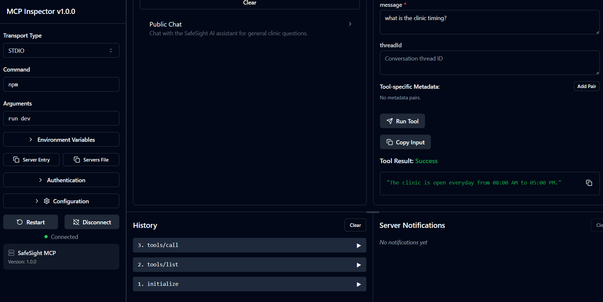
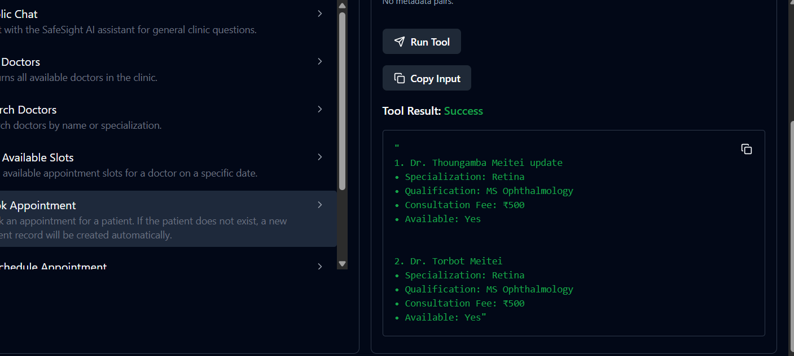
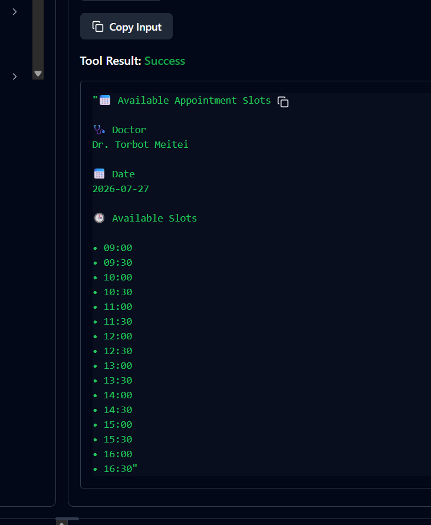
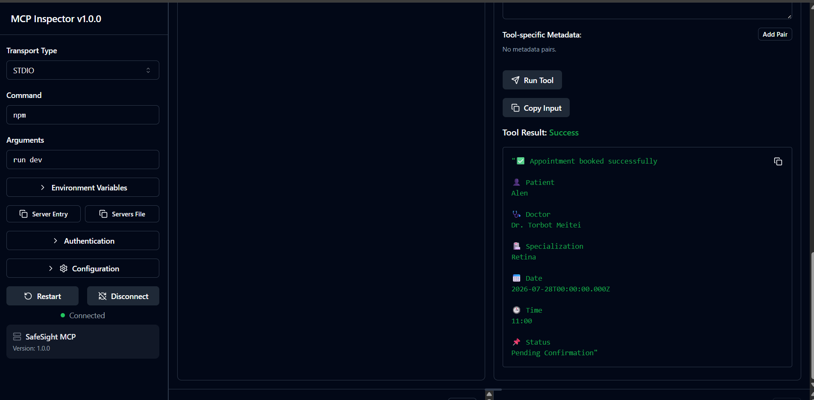

# 🏥 SafeSight MCP

> A Model Context Protocol (MCP) server that enables AI assistants to interact with the SafeSight Eye Care Management System.


---

## 📖 Overview

SafeSight MCP is a production-ready **Model Context Protocol (MCP)** server built for the **SafeSight Eye Care Management System**.

It allows AI assistants to communicate with the SafeSight backend through standardized MCP tools, enabling real-time access to clinic information, doctor availability, appointment scheduling, appointment rescheduling, and appointment cancellation.

The project is designed with a clean layered architecture, making it easy to extend with additional healthcare tools in the future.

---

## 🎯 Motivation

Large Language Models become significantly more useful when they can interact with real-world systems.

This project demonstrates how the Model Context Protocol (MCP) can securely connect an AI assistant with a healthcare management system, enabling tasks such as searching doctors, checking appointment availability, booking appointments, rescheduling visits, and cancelling appointments through standardized MCP tools.

The goal of this project is to explore AI-assisted healthcare workflows using MCP while following clean architecture and reusable design principles.

## ✨ Features

- 💬 Public AI Chat
- 👨‍⚕️ List Doctors
- 🔍 Search Doctors
- 📅 View Available Appointment Slots
- ✅ Book Appointments
- 🔄 Reschedule Appointments
- ❌ Cancel Appointments
- 🌐 Production Backend Integration
- ⚡ Modular Architecture
- 🧩 Reusable Utilities

---

## 🏗️ Architecture

```
                 AI Assistant
                       │
                       ▼
             SafeSight MCP Server
                       │
      ┌────────────────┼────────────────┐
      ▼                ▼                ▼
  Doctor Tools    Appointment Tools   Public Chat
      │                │                │
      └──────────────┬──────────────────┘
                     ▼
                Service Layer
                     ▼
                 API Client
                     ▼
          SafeSight Backend API
                     ▼
                 MongoDB Atlas
```

---

## 📂 Project Structure

```text
src/
│
├── api/
│   ├── apiClient.js
│   └── endpoints.js
│
├── config/
│   ├── constants.js
│   └── env.js
│
├── services/
│   ├── appointmentService.js
│   ├── doctorService.js
│   └── publicChatService.js
│
├── tools/
│   ├── appointmentTools.js
│   ├── doctorTools.js
│   └── publicChatTool.js
│
├── utils/
│   ├── successResponse.js
│   ├── errorResponse.js
│   ├── formatAppointment.js
│   ├── formatDoctors.js
│   └── formatSlots.js
│
└── server.js
```

---

## 🛠 Available MCP Tools

| Tool | Description |
|------|-------------|
| Public Chat | General clinic information |
| List Doctors | Returns all available doctors |
| Search Doctors | Search doctors by name or specialization |
| Get Available Slots | View appointment availability |
| Book Appointment | Create a new appointment |
| Reschedule Appointment | Update an existing appointment |
| Cancel Appointment | Cancel an appointment |

---

## ⚙️ Installation

### Clone the repository

```bash
git clone https://github.com/YOUR_USERNAME/safesight-mcp.git
```

### Install dependencies

```bash
npm install
```

### Configure environment

Create a `.env` file.

```env
BACKEND_BASE_URL=https://your-backend.onrender.com

SERVER_NAME=SafeSight MCP
SERVER_VERSION=1.0.0
```

### Run the MCP server

```bash
npm run dev
```

---

## 📸 Screenshots

### MCP Inspector

> Add screenshots inside the `screenshots/` folder.

### Public Chat



### Search Doctors



### Available Slots



### Book Appointment



---

## 🧰 Tech Stack

- Node.js
- JavaScript (ES Modules)
- Model Context Protocol SDK
- Zod
- REST API
- Express.js Backend
- MongoDB Atlas
- Render

---

## 🚀 Future Improvements

- Patient Search
- Patient Profile
- Clinic Services
- Doctor Schedule Management
- Authentication
- Streaming Responses
- Docker Support
- npm Package Distribution

---

## 📄 License

This project is licensed under the MIT License.

---

## 👨‍💻 Author

**Avinash Mutum**

If you found this project helpful, consider giving it a ⭐ on GitHub.
